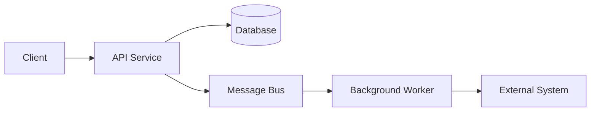
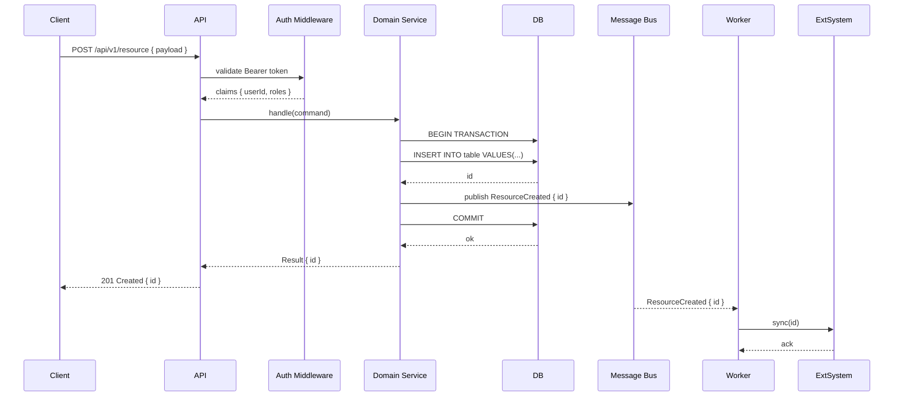
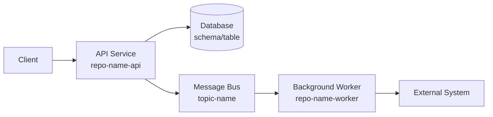
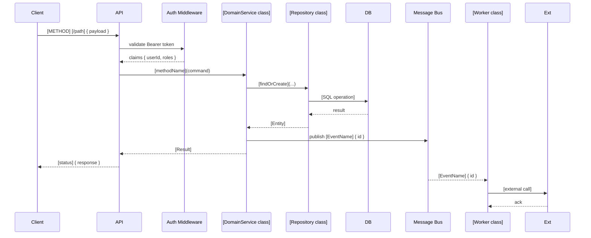

# dm-analyze

Gather all context for an Azure DevOps User Story — from ADO, Jira, and Confluence — then
synthesize a detailed solution design document covering story breakdown, technical architecture,
repository changes, database schema, API contracts, and workflow diagrams.

## Defaults

- **ADO organisation**: read from the `ADO_ORG` environment variable — ask the user if not set
- **ADO project**: ask the user if not specified
- **Output directory**: `docs/`
- **Status file freshness threshold**: 24 hours — reuse an existing status file if it is younger
  than this; otherwise refresh it

---

## Step 0 — Verify ADO MCP connection

Run `node --version`. If it fails, stop and tell the user:

> Dev Mesh requires Node.js to run its MCP servers. Please install it from https://nodejs.org
> (LTS recommended), restart your terminal, then try again.

Read the ADO organisation from the `ADO_ORG` environment variable. If it is empty or unset, stop
and tell the user:

> `ADO_ORG` is not configured. Copy `.claude/settings.local.json.example` to
> `.claude/settings.local.json` and set `ADO_ORG` to your Azure DevOps organisation name.

Verify the ADO MCP server by calling `mcp__ado__core_list_projects` with
`{ "organization": "<ADO_ORG>" }`. If it fails, stop and tell the user:

> Cannot reach the Azure DevOps MCP server. Ensure `AZURE_DEVOPS_EXT_PAT` is set with scopes:
> Work Items (Read), Code (Read), Pull Request Threads (Read). Restart your terminal after setting
> it.

---

## Step 1 — Parse the input

The user passes one of:
- A bare integer: `123` or `#123`
- An ADO work item URL: `https://dev.azure.com/<org>/<project>/_workitems/edit/123`

Extract the numeric work item ID. If a URL is provided, also extract the org and project — these
override the defaults above.

---

## Step 2 — Load or refresh the story status

Compute the expected status file path:

```
docs/[id]-[sanitized-title]/[id]-status.md
```

where `[sanitized-title]` is: lowercase, spaces and non-alphanumeric characters replaced with
hyphens, consecutive hyphens collapsed, truncated to 60 characters. (You may not know the title
yet — see below.)

**Try to read the existing status file first:**

Check whether `docs/` contains a subfolder matching `[id]-*`. If it does, read
`[id]-status.md` from that folder. Inspect the `_Last updated:` footer — if the date is today
or yesterday (within ~24 hours), treat the file as fresh and skip to Step 3 using its contents.

**If no recent status file exists**, fetch the story now by calling `mcp__ado__wit_get_work_item`:

```json
{
  "organization": "<org>",
  "id": <work_item_id>,
  "$expand": "all"
}
```

Extract and record all of the following fields (they drive every subsequent step):

| Field | ADO path |
|---|---|
| Title | `fields["System.Title"]` |
| Work item type | `fields["System.WorkItemType"]` |
| State | `fields["System.State"]` |
| Assignee | `fields["System.AssignedTo"]["displayName"]` |
| Description | `fields["System.Description"]` (strip HTML tags) |
| Acceptance criteria | `fields["Microsoft.VSTS.Common.AcceptanceCriteria"]` (strip HTML) |
| Story points | `fields["Microsoft.VSTS.Scheduling.StoryPoints"]` |
| Sprint / iteration path | `fields["System.IterationPath"]` |
| Area path | `fields["System.AreaPath"]` |
| Tags | `fields["System.Tags"]` |
| Relations | `relations` array |

Then fetch the parent item (relation `rel == "System.LinkTypes.Hierarchy-Reverse"`) and all
related items (relation `rel` in Related / Dependency / Hierarchy-Forward) following the same
logic as `dm-ado-item-status` Steps 3–4. Also fetch linked PRs and branches as described in
`dm-ado-item-status` Steps 5–6.

Write the status document to `docs/[id]-[sanitized-title]/[id]-status.md` using the format
defined in `dm-ado-item-status` Step 8, so the file is available for future reuse.

---

## Step 3 — Extract cross-system references

Scan the following fields for Jira issue keys and Confluence page links:

- Story description (HTML-stripped)
- Acceptance criteria (HTML-stripped)
- Tags
- The `attributes.comment` field on any relation entry

**Jira issue keys** — pattern: one or more uppercase letters, a hyphen, and digits, e.g.
`PROJ-123`, `NEXUS-456`. Collect all unique matches.

**Confluence page URLs** — pattern: `https://<host>/wiki/spaces/<space>/pages/<id>` or
`https://<host>/display/<space>/<title>`. Collect all unique URLs.

Also check `relations` for ArtifactLink entries whose `url` contains `jira` or `confluence` in
the hostname.

---

## Step 4 — Fetch Jira issues (if any)

If Jira issue keys were found in Step 3, check whether the Atlassian MCP server is reachable by
attempting `mcp__claude_ai_Atlassian__authenticate`. If the MCP server is not available, note
this in the analysis document as a gap and continue.

For each Jira issue key, call `mcp__mcp-atlassian__jira_get_issue`:
```json
{
  "issue_key": "<PROJ-123>"
}
```

Record: issue key, summary, status, issue type, assignee, description, acceptance criteria /
definition of done (custom field), sprint, story points, and any sub-tasks or linked issues.

---

## Step 5 — Fetch Confluence pages (if any)

For each Confluence URL found in Step 3, call `mcp__mcp-atlassian__confluence_get_page` with the
numeric page ID extracted from the URL. If only a slug/title URL is available, first call
`mcp__mcp-atlassian__confluence_search` to resolve it to a page ID.

Record: page title, space key, last modified date, and the full page body (Markdown). Use this
content to understand technical context, existing architecture decisions, or constraints that should
influence the solution design.

---

## Step 6 — Fetch sprint and Epic/Feature context

### Sprint / iteration

From the story's `System.IterationPath`, call `mcp__ado__work_list_team_iterations` to get the
iteration details (start date, finish date, sprint name). Record the exact iteration path — all
child tickets created in the solution design must use this same iteration path.

### Epic / Feature (parent chain)

The parent fetched in Step 2 may itself have a parent. Walk up the hierarchy until you reach an
Epic or the root. For each ancestor, record: type, ID, title, state, iteration path.

The **immediate parent** (Feature or Epic) is the one all new child stories must be linked under.
Record its ID as `<parent_id>` — it will be referenced in the story breakdown table.

---

## Step 7 — Discover and scan repositories

This step reads real code before any design decision is made. Claims about what exists must be
verified against the codebase, not inferred.

### 7a — Identify involved repositories

Collect repo candidates from three sources:

1. **Linked PRs (Step 2)** — record each `repository.name` and `repository.id` from the PR
   metadata fetched in Step 2.
2. **Branch artifact links (Step 2)** — ArtifactLink entries whose `url` contains `/Ref/` encode
   the repo ID; extract and resolve to a repo name.
3. **Tags and description keywords** — scan for repo name patterns (e.g. `<name>-api`,
   `<name>-worker`, `<name>-ui`) mentioned in the description, AC, or Confluence pages.

Deduplicate. If no repos are identified from the above, call
`mcp__ado__repo_list_repos_by_project` with `{ "organization": "<org>", "project": "<project>" }`
and ask the user which repos are in scope before proceeding.

### 7b — Search each repo for relevant code

For every identified repo, run targeted code searches with `mcp__ado__search_code` to locate the
files most relevant to the story. Run multiple queries — one per significant concept or entity
mentioned in the story. Examples:

```json
{
  "organization": "<org>",
  "searchText": "<entity or feature keyword>",
  "filters": { "Project": ["<project>"], "Repository": ["<repo-name>"] }
}
```

Collect the matching file paths and line snippets. Group findings by repo. Identify:
- **Entry points** — controllers, route handlers, command handlers, API gateway config
- **Domain / business logic** — services, use-cases, domain models, aggregates
- **Data access** — repositories, DAO classes, ORM models, stored procedures, migration files
- **Background jobs / workers** — queue consumers, scheduled jobs, event handlers
- **Tests** — unit / integration test files for the affected modules
- **Configuration** — app settings, feature flags, environment-specific config

If `mcp__ado__search_code` is unavailable, fall back to listing branches and reading the repo's
directory structure via `mcp__ado__repo_list_branches_by_repo`, then read key files directly
using `mcp__ado__repo_get_repo_by_name_or_id` to confirm file layout.

### 7c — Read key existing files

For each file identified in 7b that is central to the change (entry point, domain model, migration
folder, API contract file), read its content using the ADO REST API or, if the repo is checked out
locally, the Read tool. Specifically:

- **API route / controller** — understand existing request validation, auth middleware, response
  shape, and error handling conventions already in use.
- **Domain model / entity** — confirm current field names, types, relationships, and any value
  objects or enumerations relevant to the story.
- **Database migration files** — read the latest migration to understand the current schema
  baseline, naming conventions (snake_case vs PascalCase, ID column patterns), and the migration
  framework in use (EF Core, Flyway, Liquibase, Alembic, etc.).
- **Existing API contract / OpenAPI spec** — if a `swagger.json`, `openapi.yaml`, or generated
  contract file exists, read it to understand existing endpoint conventions, authentication
  schemes, and versioning strategy.
- **Test examples** — read one representative unit test and one integration test to understand
  the testing patterns and assertion style used in the project.

Record what you find verbatim (file path + relevant excerpt). Do not paraphrase or assume — use
exact class names, method signatures, table names, and column names as they appear in the code.
These drive the specificity of the solution design.

### 7d — Identify patterns and conventions

From the files read, derive:
- **Naming conventions**: camelCase / PascalCase / snake_case for API fields vs DB columns
- **Auth pattern**: JWT bearer, API key, OAuth scopes — where and how applied in existing
  controllers
- **Error handling pattern**: problem-details RFC 7807, custom error envelope, HTTP status codes
  used for validation vs server errors
- **DB transaction pattern**: unit-of-work, explicit transactions, saga pattern
- **Event / messaging pattern**: if the project publishes domain events or messages, note the
  broker (Service Bus, RabbitMQ, Kafka), serialization format, and topic naming scheme
- **Migration strategy**: whether the project uses up/down migrations, idempotent scripts, or a
  code-first migration generator; whether zero-downtime migrations are required

---

## Step 8 — Deep technical analysis and approach evaluation

With real codebase knowledge from Step 7, perform a full technical analysis before writing the
design document.

### 8a — Problem statement and AC review

Derive a crisp 2–4 sentence problem statement that combines:
- The story's description and acceptance criteria
- Constraints surfaced in Jira issues or Confluence pages
- Gaps or ambiguities revealed by reading the codebase (e.g., the AC says "update the record" but
  the current schema has no such field)

For each acceptance criterion, assess:
- **Testable?** Can it be verified by an automated test or a clear manual check?
- **Completeness** — does it specify the full happy path, error states, and edge cases?
- **Codebase impact** — which specific files, classes, or DB tables are affected?
- **Conflicts** — does it contradict an existing behaviour found in the codebase?

Record gaps explicitly — they become Open Questions in the design document.

### 8b — Story decomposition

Determine the minimal set of child stories needed to deliver all acceptance criteria
independently. Apply these rules:

- Each child story must be independently deliverable, deployable (if feature-flagged), and
  testable in isolation.
- Separate stories by layer where there is genuine complexity: schema migration, API change,
  business logic, UI, background job, integration event.
- A pure schema migration that other stories depend on must be its own story and sequenced first.
- Do not create a story for boilerplate that is a natural part of another story (e.g., a simple
  DTO change does not need its own story).
- Each child story must target the **same sprint** (`[iteration path]`) and be linked to the
  **same parent** (`[parent_id]`) as the original story.

For each child story record:
- Proposed title
- Work item type (User Story / Task / Bug)
- Story point estimate (Fibonacci: 1, 2, 3, 5, 8, 13)
- Affected repos and services
- One-paragraph scope description
- Draft acceptance criteria (at least 2–3 testable criteria)
- Dependencies on other child stories (sequencing)

### 8c — Approach options for the most complex aspect

Identify the single most technically ambiguous or risky decision in the design. Propose exactly
two or three concrete approaches for it. For each approach provide:
- One-sentence mechanism description
- Pros (2–3 bullets)
- Cons / risks (2–3 bullets)
- When it is the right choice

State a clear recommendation and justify it with evidence from the codebase (e.g., "the project
already uses X pattern in `path/to/file`, so Approach A has lower integration cost").

Do not evaluate approaches on implementation details that belong in a PR — focus on structural
decisions that affect how the child stories are scoped and sequenced.

### 8d — Detailed repository change plan

For each child story, map out the exact file-level changes needed in each repo:

- **Files to create** — full repo-relative path, what the file contains, which existing file it
  follows as a pattern
- **Files to modify** — full repo-relative path, which class / method / section changes, what
  the change is (new field, new method, changed signature, new middleware registration)
- **Files to delete** — only if confirmed dead code from the codebase scan

Use exact class names, method names, and file paths found in Step 7. Do not invent names.

### 8e — Database change plan

For each table affected, write the specific DDL or migration pseudo-code:

```sql
-- Migration: add <column> to <table>
ALTER TABLE <table>
  ADD COLUMN <column> <TYPE> [NOT NULL DEFAULT <value> | NULL];

-- Index (if query patterns require it)
CREATE INDEX idx_<table>_<column> ON <table>(<column>);
```

Classify each change:
- **Additive-only** (safe for zero-downtime deploy): new column with default, new table, new index
- **Breaking** (requires coordinated deploy or feature flag): rename, drop, type change, NOT NULL
  on existing column without default

If no DB changes are required, state this explicitly.

### 8f — API contract design

For each new or changed endpoint, design the full contract using real field names derived from
the domain model found in Step 7:

- HTTP method + path (follow the versioning convention already in use, e.g. `/api/v2/`)
- Auth requirement (which scope / role, based on existing middleware pattern)
- Request body: full JSON schema with field name, type, required/optional, constraints, example
- Response body: full JSON schema for each status code returned
- Error responses: status code, error code string, human-readable message pattern

Where the story requires a background job or event, also design:
- Message/event payload schema (JSON)
- Topic / queue name (follow existing naming convention)
- At-least-once vs exactly-once delivery requirements

### 8g — Workflow diagrams

Draft two Mermaid diagrams:

**High-level component diagram** — shows which services, databases, queues, and external systems
are involved and how they connect:



**Detailed sequence diagram** — shows the request/response flow through all layers for the
primary happy-path use case, including auth, validation, persistence, and any async steps:



Populate with real service names, endpoint paths, table names, and event names from Steps 7 and 8.

---

## Step 9 — Compose the solution design document

Write the complete document now, filling every section with real content derived from the analysis.
Do not leave any placeholder text. If a section genuinely does not apply, write one sentence
stating why (e.g., "No database changes are required — this story only modifies business logic
in an existing stateless service.").

Use exactly this structure:

````markdown
# Solution Design: ADO [ID] — [Title]

> **Analysis generated** [YYYY-MM-DD] | Sprint: `[iteration path]` | Parent: [parent type] [parent ID] — [parent title]

---

## Problem Statement

[2–4 sentences. State the user/business problem, what is currently missing or broken, and what
"done" looks like. Incorporate constraints from Jira/Confluence if relevant.]

---

## Acceptance Criteria Review

| # | Criterion | Testable? | Codebase Impact | Notes |
|---|---|---|---|---|
| 1 | [verbatim AC text] | Yes / Needs clarity | [file or module] | [gap or clarification] |

**Gaps identified:**
- [Specific criterion that is vague or untestable, and what information is needed to resolve it]

_(none)_ if all criteria are clear.

---

## Approach Options — [Decision Title]

[Describe the key technical decision this section addresses in 1 sentence.]

### Option A — [Name]
[Mechanism description — 1 sentence]
**Pros:** ...
**Cons / risks:** ...
**Best when:** ...

### Option B — [Name]
[Mechanism description — 1 sentence]
**Pros:** ...
**Cons / risks:** ...
**Best when:** ...

### Option C — [Name] _(if applicable)_
...

**Recommendation:** Option [X] because [evidence from codebase, e.g., "the project already uses
this pattern in `src/handlers/ExampleHandler.cs` — adopting it here keeps the codebase consistent
and avoids introducing a new abstraction"].

---

## Story Breakdown

All stories below target sprint `[iteration path]` and must be linked to
[parent type] **[parent ID]**: [parent title].

### Story 1 — [Title]

| Field | Value |
|---|---|
| **Type** | User Story |
| **Estimate** | [n] points |
| **Repos / Services** | [repo-name-1], [repo-name-2] |
| **Depends on** | — (no dependency) or Story N above |

**Scope:** [1–2 sentences describing exactly what this story delivers, no more.]

**Acceptance criteria:**
1. Given [context], when [action], then [observable outcome].
2. Given [context], when [action], then [observable outcome].
3. [Error path] returns [HTTP status / message].

**Key files touched:**
- `[repo]/[path/to/Controller.cs]` — [what changes]
- `[repo]/[path/to/Service.cs]` — [what changes]
- `[repo]/[path/to/Migration_YYYYMMDD.sql]` — [what is added]

---

### Story 2 — [Title]

_(repeat structure above for each child story)_

---

## Repository Changes

### [Repo Name 1]

#### Files to create

| File | Pattern followed | Contents |
|---|---|---|
| `src/handlers/[NewHandler].cs` | `src/handlers/[ExistingHandler].cs` | Command handler for [operation] |

#### Files to modify

| File | Change |
|---|---|
| `src/api/routes/[router].ts` | Add `POST /[path]` route, wire to `[Handler]` |
| `src/models/[Entity].cs` | Add `[FieldName]` property (`[Type]`, nullable) |
| `src/Program.cs` | Register `[NewService]` in DI container |

#### Files to delete

_(none)_ or list with justification.

---

### [Repo Name 2]

_(repeat structure above)_

---

## Database Changes

### Schema changes

| # | Type | Table | Object | DDL |
|---|---|---|---|---|
| 1 | Add column | `[table]` | `[column]` | `ALTER TABLE [table] ADD [column] [TYPE] NULL;` |
| 2 | Add index | `[table]` | `idx_[table]_[column]` | `CREATE INDEX ... ON [table]([column]);` |

**Migration file:** `[repo]/db/migrations/[YYYYMMDD_description].sql`

**Migration framework:** [EF Core / Flyway / Liquibase / etc. — as found in Step 7]

**Zero-downtime safe?** Yes — all changes are additive. / No — [column rename / NOT NULL without
default] requires a coordinated deploy; see Story N which handles this in two phases.

**Rollback:** [Describe the down-migration or rollback procedure]

### Current schema baseline (relevant tables)

```sql
-- As found in [repo]/db/migrations/[latest migration file]
CREATE TABLE [table] (
  [column] [TYPE] [constraints],
  ...
);
```

---

## API Contracts

### `[HTTP METHOD] [/api/vN/path]`

**Auth:** Bearer JWT — requires scope `[scope]` or role `[role]`
_(as enforced by `[AuthMiddleware class/file found in Step 7]`)_

**Request body:**
```json
{
  "[field]": "[string | number | boolean | object]",  // required — [description]
  "[field]": "[type]",                                // optional — [description, constraints]
}
```

**Validation rules:**
- `[field]`: [max length / regex / enum values / range]
- `[field]`: required when `[condition]`

**Response `201 Created`:**
```json
{
  "id": "uuid",
  "[field]": "[type]",
  "createdAt": "ISO-8601 timestamp"
}
```

**Response `400 Bad Request`** (validation failure):
```json
{
  "type": "https://example.com/errors/validation",
  "title": "Validation failed",
  "status": 400,
  "errors": {
    "[field]": ["[message]"]
  }
}
```

**Response `401 Unauthorized`** — missing or invalid Bearer token.
**Response `403 Forbidden`** — authenticated but insufficient scope/role.
**Response `409 Conflict`** — [describe the conflict condition].
**Response `500 Internal Server Error`** — unexpected error; `traceId` in body for correlation.

---

_(repeat for each new or changed endpoint)_

---

## Event / Message Contracts _(if applicable)_

### `[EventName]` — published by [Service] on [Topic/Queue]

**Trigger:** [when this event is published]

**Payload:**
```json
{
  "eventType": "[EventName]",
  "eventId": "uuid",
  "occurredAt": "ISO-8601",
  "payload": {
    "[field]": "[type]"
  }
}
```

**Consumer:** [Worker / Service that subscribes] — [what it does on receipt]
**Delivery guarantee:** At-least-once — consumer must be idempotent on `eventId`.

---

## Workflow Diagrams

### High-level architecture



### Request sequence — [primary use case]



---

## Integration Points

| System | Reference | Data direction | Role in this design |
|---|---|---|---|
| Jira | [[PROJ-123]]: [summary] | Read | [what constraint or context it provides] |
| Confluence | [Page title] (space: [KEY]) | Read | [what architecture decision or spec it defines] |
| [External API] | [name / doc URL] | Write | [what this design calls and why] |

_(none)_ if no cross-system links were found.

---

## Risks & Dependencies

| # | Risk / Dependency | Likelihood | Impact | Mitigation |
|---|---|---|---|---|
| 1 | [description — be specific, e.g. "Schema migration on `orders` table with 50M rows may lock for >30s under default isolation"] | Low / Med / High | Low / Med / High | [action — e.g., "run during low-traffic window; use ONLINE=ON if SQL Server 2019+"] |
| 2 | [External team / service dependency] | Med | High | [escalation path or fallback] |
| 3 | [Security concern — OWASP reference if applicable] | Low | High | [specific control already in place or to be added] |

---

## Open Questions

1. **[Question]** — [who owns the answer and by when it must be resolved]
2. **[Question]** — [impact on scope if unresolved before sprint start]

_(none)_ if all decisions are resolved.

---

_Generated by dm-analyze · [YYYY-MM-DD]_
````

---

## Step 10 — Save the document

The output folder was created in Step 2 (it holds the status file). Write the analysis to:

```
docs/[id]-[sanitized-title]/[id]-analyze.md
```

Create `docs/` and the story subfolder if they do not exist.

---

## Step 11 — Present to chat

Output to chat in this order:

1. **Problem Statement** verbatim
2. **Approach Recommendation** (one sentence — which option and why)
3. **Story Breakdown** — the title, estimate, and one-line scope for each child story, formatted
   as a numbered list
4. One paragraph covering the most significant technical finding from the codebase scan (e.g., a
   naming convention mismatch, a schema constraint, an existing pattern to reuse)
5. `Full solution design saved to docs/[id]-[sanitized-title]/[id]-analyze.md`
